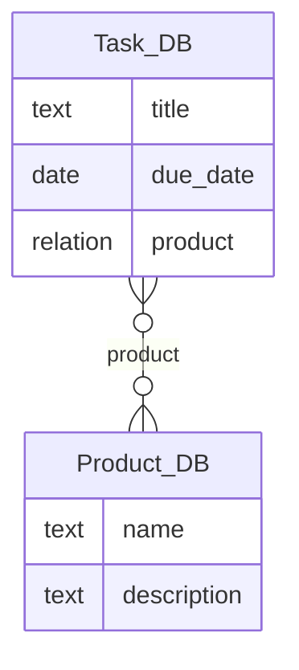

# Notion ERD Exporter

Notionのデータベース構造（プロパティ定義・Relation/Rollupの結合関係）をAPIから取得し、ERD風のMermaidとDBMLを自動生成するスクリプトです。

## 機能

- Notionワークスペース内のデータベースを自動検索
- 各データベースのスキーマ（プロパティ）を取得
- Relation/Rollupからデータベース間のエッジを抽出
- Mermaid ER図（`.mmd`）とDBML（`.dbml`）を生成
- Cursorやドキュメントで参照可能な形式で出力

## 事前準備

### 1. Notion Integration Tokenの取得

1. [Notion Integrations](https://www.notion.so/my-integrations) にアクセス
2. 新しいInternal Integrationを作成
3. Integration Token（`secret_xxx`）をコピー

### 2. データベースへのアクセス許可

対象データベースに対して、作成したIntegrationを招待：
1. Notionでデータベースを開く
2. 右上の「Share」をクリック
3. 「Invite」で作成したIntegrationを追加

### 3. 環境変数の設定

```bash
export NOTION_TOKEN="secret_xxx"
```

特定のデータベース名でフィルタリングする場合（オプション）:
```bash
export NOTION_DB_NAME_FILTER="Sales, Customers"
```

## インストール

### 依存関係のインストール

```bash
pip install -r requirements.txt
```

または、UVを使用する場合：
```bash
uv pip install -r requirements.txt
```

## 使用方法

### 基本的な使い方（ワークスペース全体をスキャン）

```bash
# デフォルトの出力先（../docs/notion/erd/）を使用する場合
python notion_erd_exporter.py --workspace-scan

# 出力先を明示的に指定する場合
python notion_erd_exporter.py \
  --workspace-scan \
  --out-mermaid ../docs/notion/erd/notion_erd.mmd \
  --out-dbml ../docs/notion/erd/notion_schema.dbml
```

### 特定のデータベースのみを処理する場合

```bash
# デフォルトの出力先を使用
python notion_erd_exporter.py \
  --db-ids "afafabe758044461a3e9e9b4c037e5aa,0d0b0f9639454862af2b2c401f229ca6"

# 出力先を明示的に指定する場合
python notion_erd_exporter.py \
  --db-ids "afafabe758044461a3e9e9b4c037e5aa,0d0b0f9639454862af2b2c401f229ca6" \
  --out-mermaid ../docs/notion/erd/notion_erd.mmd \
  --out-dbml ../docs/notion/erd/notion_schema.dbml
```

### 出力ファイルの場所

デフォルトの出力先は以下の通りです（スクリプト実行時のカレントディレクトリからの相対パス）:
- `../docs/notion/erd/notion_erd.mmd` - Mermaid ER図
- `../docs/notion/erd/notion_schema.dbml` - DBMLスキーマ

これにより、Cursorやその他のエージェントがいつでも `docs/notion/erd/` 配下のファイルを参照できます。

## 生成物の使い方

### Mermaid ER図（`.mmd`）

- Cursorで開き、MermaidプレビューまたはMarkdownに埋め込み可能
- GitHub/GitLabのMarkdownで自動的にレンダリングされる
- オンラインツール（[Mermaid Live Editor](https://mermaid.live/)）で可視化可能

### DBML（`.dbml`）

- [dbdiagram.io](https://dbdiagram.io/) で読み込み可能
- Holistics などのモデリングツールで連携可能
- データベース設計の議論材料として使用

## カーディナリティについて

NotionのRelationは複数選択が基本で、アプリ側の運用で「1つだけ選ぶ」等の制約を課していることが多いです。

本スクリプトは安全側に倒し、**N:M（}o--o{）** をデフォルトとしています。

将来的に、組織の運用に合わせてカーディナリティを手動で調整する機能を追加予定です。

## トラブルシューティング

### データベースが検出されない

- Integrationが対象データベースにShareされているか確認
- データベースがPrivateの場合は、必ずIntegrationを招待する必要があります

### 429 Too Many Requests エラー

- APIレート制限に達している可能性があります
- スクリプト内で自動的にスリープ（0.3秒）が入っていますが、大量のデータベースがある場合は時間がかかります

### 権限不足エラー

- Private DBは統合を招待しない限り取得不可
- Integration Tokenが正しく設定されているか確認

## 出力例

### Mermaid ER図（.mmd）



### DBML（.dbml）

```dbml
Table Task_DB {
  title text
  due_date date
  product relation
}

Table Product_DB {
  name text
  description text
}

Ref: Task_DB.product > Product_DB.id // Notion relation (cardinality approx)
```

## 拡張ポイント

- **Rollupの注釈強化**: どのRelation由来で、何を集計/表示しているかをエッジラベルに出力
- **型マッピングの最適化**: Notion→RDBの型表を組織標準に合わせて調整
- **フィルタ**: `NOTION_DB_NAME_FILTER` で対象DBを限定（大規模ワークスペース向け）
- **可視化**: Mermaidでは長大なノードが見にくい場合、プロパティ出力をtitle/key系のみに抑えるオプションを導入

## 参考リンク

- [Notion API ドキュメント](https://developers.notion.com/reference)
- [Mermaid ER図 ドキュメント](https://mermaid.js.org/syntax/entityRelationshipDiagram.html)
- [DBML ドキュメント](https://dbml.dbdiagram.io/home)

